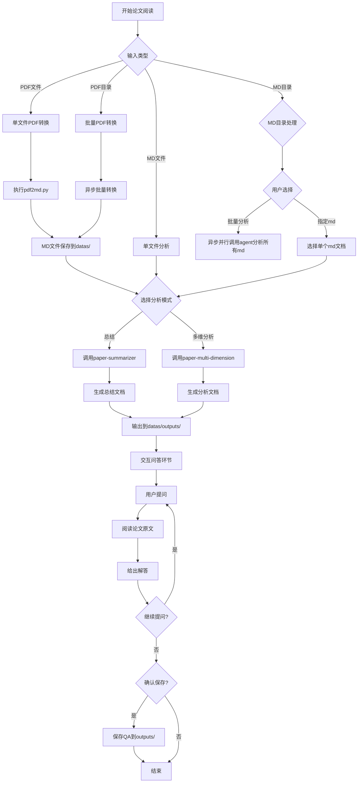

# 论文阅读技能

完整的论文阅读工作流，从PDF转换到结构化分析再到交互问答。

## 工作流程概览



---

## 第一阶段：输入处理

根据用户输入类型，执行不同的处理流程：

### 输入类型判断

| 输入类型 | 处理方式 | 后续阶段 |
|---------|---------|---------|
| PDF文件路径 | 单文件转换 | 进入第二阶段 |
| PDF目录路径 | 批量转换 | 进入第二阶段 |
| MD文件路径 | 直接分析 | 进入第二阶段 |
| MD目录路径 | 用户选择批量或指定 | 进入第二阶段 |

### PDF转MD

#### 单文件转换

执行转换命令：

```bash
python .claude/skills/paper-reader/scripts/pdf2md.py <pdf文件路径>
```

输出保存到 `datas/` 目录，文件名为 `[论文名].md`。

#### 批量转换

转换目录下所有PDF文件：

```bash
python .claude/skills/paper-reader/scripts/pdf2md.py <pdf目录路径>
```

支持并行处理：

```bash
python .claude/skills/paper-reader/scripts/pdf2md.py <pdf目录路径> --workers 4
```

**可选参数：**
- `--pages`: 提取指定页码（如 `"1-3"` 或 `"1,3,5"`）
- `--pdf-only`: 只转换不格式化
- `--inplace`: 原地替换原文件

### MD文档目录处理

当用户输入的是包含md文档的目录路径时：

1. **识别目录结构**：确认目录下所有文件都是.md文档
2. **交互选择模式**：询问用户执行哪种分析模式
   
   ```
   发现目录下有 N 个 md 文档：
   - 批量分析：异步并行调用 agent 分析所有文档
   - 指定分析：选择一个 md 文档进行分析
   ```

#### 批量分析模式

异步并行调用多个 agent 同时处理所有 md 文档：

1. **并行启动多个 agent 实例**，每个 agent 负责一个 md 文档
2. 所有 agent 同时执行分析任务
3. 等待所有 agent 完成

**输出保存：**
- 路径：`datas/outputs/summary-[论文名].md`（每个文档独立）
- 路径：`datas/outputs/analysis-[论文名].md`（每个文档独立）

#### 指定分析模式

列出目录下所有md文档，让用户选择：

```
可用文档：
1. paper1.md
2. paper2.md
...

请选择要分析的文档编号：
```

选择后进入第二阶段的单文档分析流程。

---

## 第二阶段：论文分析

转换完成后，交互选择执行的分析模式。不要直接读取全文内容。

### 模式A：论文总结

调用 `paper-summarizer` agent 生成结构化总结：

**输出保存：**
- 路径：`datas/outputs/summary-[论文名].md`

### 模式B：多维深度分析

调用 `paper-multi-dimension` agent 进行多维度分析：

**输出保存：**
- 路径：`datas/outputs/analysis-[论文名].md`

---

## 第三阶段：交互问答

分析文档生成后，进入交互问答环节。

### 问答流程

1. 提示用户输入关于论文的问题
2. 读取论文原文（转换后的MD文件）
3. 基于原文内容给出解答
4. 支持多轮问答
5. 问答结束后询问是否保存

### 保存问答记录

确认保存后，将问答记录写入：

- 路径：`datas/outputs/QA-[论文名].md`
- 格式：问题与答案对照

---

## 输出文件规范

| 阶段 | 文件类型 | 文件命名 | 保存位置 |
|------|---------|---------|---------|
| PDF转换 | MD文档 | `[论文名].md` | `datas/` |
| 论文总结 | MD文档 | `summary-[论文名].md` | `datas/outputs/` |
| 多维分析 | MD文档 | `analysis-[论文名].md` | `datas/outputs/` |
| 问答记录 | MD文档 | `QA-[论文名].md` | `datas/outputs/` |

---

## 子代理集成

详细使用说明参见：

- **论文总结代理**：见 [paper-summarizer.md](agents/paper-summarizer.md)
- **多维分析代理**：见 [paper-multi-dimension.md](agents/paper-multi-dimension.md)

---

## 注意事项

- PDF转换需要确保 markitdown 安装在当前环境中
- 批量转换时默认使用4个并行进程
- outputs 目录会自动创建
- 问答环节可进行多轮对话
- 保存问答前需要用户确认