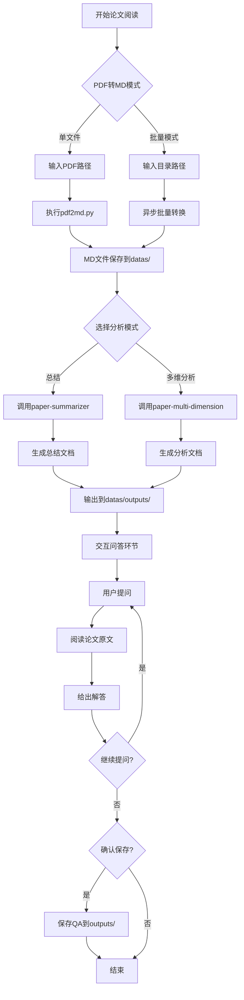

# 论文阅读技能

完整的论文阅读工作流，从PDF转换到结构化分析再到交互问答。

## 工作流程概览



---

## 第一阶段：PDF转MD

- 如果用户输入的是PDF文件路径，执行单文件转换
- 如果用户输入的是目录路径，执行批量转换
- 如果用户输入的是md文档路径，直接进入第二阶段。注意不要直接读取全文内容。

### 单文件转换

执行转换命令：

```bash
python .claude/skills/paper-reader/scripts/pdf2md.py <pdf文件路径>
```

输出保存到 `datas/` 目录，文件名为 `[论文名].md`。

### 批量转换

转换目录下所有PDF文件：

```bash
python docv/scripts/pdf2md.py <pdf目录路径>
```

支持并行处理：

```bash
python docs/scripts/pdf2md.py <pdf目录路径> --workers 4
```

**可选参数：**
- `--pages`: 提取指定页码（如 `"1-3"` 或 `"1,3,5"`）
- `--pdf-only`: 只转换不格式化
- `--inplace`: 原地替换原文件

---

## 第二阶段：论文分析

转换完成后，交互选择执行的分析模式。不要直接读取全文内容。

### 模式A：论文总结

调用 `paper-summarizer` subagent 生成结构化总结：

**输出保存：**
- 路径：`datas/outputs/summary-[论文名].md`

### 模式B：多维深度分析

调用 `paper-multi-dimension` subagent 进行多维度分析：

**输出保存：**
- 路径：`datas/outputs/analysis-[论文名].md`

---

## 第三阶段：交互问答

分析文档生成后，进入交互问答环节。

### 问答流程

1. 提示用户输入关于论文的问题
2. 读取论文原文（转换后的MD文件）
3. 基于原文内容给出解答
4. 支持多轮问答
5. 问答结束后询问是否保存

### 保存问答记录

确认保存后，将问答记录写入：

- 路径：`datas/outputs/QA-[论文名].md`
- 格式：问题与答案对照

---

## 输出文件规范

| 阶段 | 文件类型 | 文件命名 | 保存位置 |
|------|---------|---------|---------|
| PDF转换 | MD文档 | `[论文名].md` | `datas/` |
| 论文总结 | MD文档 | `summary-[论文名].md` | `datas/outputs/` |
| 多维分析 | MD文档 | `analysis-[论文名].md` | `datas/outputs/` |
| 问答记录 | MD文档 | `QA-[论文名].md` | `datas/outputs/` |

---

## 子代理集成

详细使用说明参见：

- **论文总结代理**：见 [paper-summarizer.md](agents/paper-summarizer.md)
- **多维分析代理**：见 [paper-multi-dimension.md](agents/paper-multi-dimension.md)

---

## 注意事项

- PDF转换需要确保 markitdown 安装在当前环境中
- 批量转换时默认使用4个并行进程
- outputs 目录会自动创建
- 问答环节可进行多轮对话
- 保存问答前需要用户确认