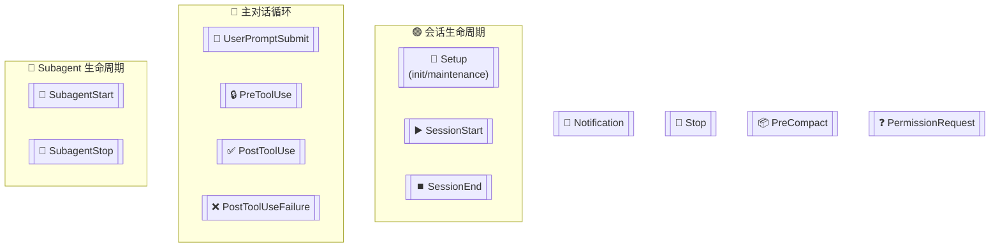

# Claude Code Hooks 最佳实践

> 基于 Claude Code Hooks Mastery 项目的实践经验总结

---

## 1. Hook 架构核心概念

### 1.1 Hook 生命周期概览

Claude Code 提供 13 种 Hook 事件，覆盖完整会话周期：



### 1.2 Hook 类型与控制能力矩阵

| Hook 类型 | 阻塞能力 | JSON 控制 | 典型用途 |
|-----------|----------|------------|----------|
| `UserPromptSubmit` | ✅ 阻止提示 | `continue: false` | 验证、增强、阻止提示 |
| `PreToolUse` | ✅ 阻止工具 | `decision: "block"` | 安全验证、参数检查 |
| `PostToolUse` | ❌ 无法阻止 | `decision: "block"` | 验证结果、格式化、清理 |
| `Stop` | ✅ 阻止停止 | `decision: "block"` | 确保任务完成 |
| `SubagentStop` | ✅ 阻止停止 | `decision: "block"` | 确保子任务完成 |
| `SubagentStart` | ❌ 无法阻止 | N/A | 日志、初始化 |
| `SessionStart` | ❌ 无法阻止 | N/A | 上下文加载、环境设置 |
| `SessionEnd` | ❌ 无法阻止 | N/A | 清理、日志 |
| `Notification` | ❌ 无法阻止 | N/A | 通知、TTS 提醒 |
| `PreCompact` | ❌ 无法阻止 | N/A | 备份、预压缩 |
| `PermissionRequest` | ❌ 无法阻止 | N/A | 权限审计、自动批准 |
| `PostToolUseFailure` | ❌ 无法阻止 | N/A | 错误日志 |
| `Setup` | ❌ 无法阻止 | N/A | 初始化、维护 |

---

## 2. UV 单文件脚本架构

### 2.1 为什么使用 UV Scripts

项目采用 [UV single-file scripts](https://docs.astral.sh/uv/guides/scripts/) 架构：

**优势**：
- **隔离性** - Hook 逻辑与主项目依赖分离
- **可移植性** - 每个脚本声明自己的依赖
- **无需虚拟环境** - UV 自动处理依赖
- **快速执行** - UV 依赖解析极快
- **自包含** - 每个 Hook 可独立理解和修改

### 2.2 脚本标准格式

```python
#!/usr/bin/env -S uv run --script
# /// script
# requires-python = ">=3.11"
# dependencies = [
#     "python-dotenv",
# ]
# ///

import json
import sys

def main():
    # 读取 stdin JSON
    input_data = json.loads(sys.stdin.read())
    
    # 处理逻辑
    
    sys.exit(0)

if __name__ == '__main__':
    main()
```

### 2.3 路径规范

> **重要**：使用 `$CLAUDE_PROJECT_DIR` 确保跨工作目录的可靠路径解析

```python
# 正确
script_dir = Path("$CLAUDE_PROJECT_DIR/.claude/hooks/")

# 错误
script_dir = Path("./.claude/hooks/")
```

---

## 3. 退出码与流控制

### 3.1 退出码行为

| 退出码 | 行为 | 说明 |
|--------|------|------|
| **0** | 成功 | `stdout` 在 Transcript 模式下显示给用户 |
| **2** | 阻塞错误 | `stderr` 自动反馈给 Claude |
| **其他** | 非阻塞错误 | `stderr` 显示给用户，执行继续 |

### 3.2 JSON 输出控制

**通用字段（所有 Hook 类型）**：
```json
{
  "continue": true,
  "stopReason": "阻止原因说明",
  "suppressOutput": true
}
```

**PreToolUse 决策控制**：
```json
{
  "decision": "approve",
  "reason": "批准原因"
}
```
- `"approve"`：绕过权限系统
- `"block"`：阻止工具执行

**PostToolUse 决策控制**：
```json
{
  "decision": "block",
  "reason": "提示 Claude 重新处理"
}
```

**Stop 决策控制**：
```json
{
  "decision": "block",
  "reason": "如何继续完成任务"
}
```

### 3.3 流控制优先级

1. **`"continue": false`** - 最高优先级
2. **`"decision": "block"`** - Hook 特定阻塞
3. **Exit Code 2** - 简单阻塞
4. **其他退出码** - 非阻塞错误

---

## 4. 最佳实践模式

### 4.1 UserPromptSubmit Hook - 提示验证与增强

```python
def validate_prompt(prompt):
    """验证提示内容"""
    blocked_patterns = [
        ('rm -rf /', '危险命令检测'),
    ]
    
    for pattern, reason in blocked_patterns:
        if pattern.lower() in prompt.lower():
            return False, reason
    return True, None

def main():
    input_data = json.loads(sys.stdin.read())
    prompt = input_data.get('prompt', '')
    
    # 验证
    is_valid, reason = validate_prompt(prompt)
    if not is_valid:
        print(f"提示被阻止: {reason}", file=sys.stderr)
        sys.exit(2)
    
    # 上下文注入（打印到 stdout）
    print(f"项目: MyApp\n标准: REST API")
    
    sys.exit(0)
```

**关键要点**：
- 退出码 2 阻止提示
- `stdout` 内容被添加到提示前
- 适合安全过滤、上下文注入

### 4.2 PreToolUse Hook - 安全阻塞

```python
def is_dangerous_command(command):
    """检测危险命令"""
    patterns = [
        r'\brm\s+.*-[a-z]*r[a-z]*f',
        r'sudo\s+rm',
    ]
    return any(re.search(p, command) for p in patterns)

def main():
    input_data = json.load(sys.stdin)
    tool_name = input_data.get('tool_name', '')
    tool_input = input_data.get('tool_input', {})
    
    if tool_name == 'Bash':
        command = tool_input.get('command', '')
        if is_dangerous_command(command):
            print("阻止: 危险命令", file=sys.stderr)
            sys.exit(2)
    
    sys.exit(0)
```

**关键要点**：
- 退出码 2 阻止工具执行
- `stderr` 显示给 Claude
- 适合安全验证、参数检查

### 4.3 PostToolUse Hook - 结果验证

```python
def validate_output(tool_name, tool_response):
    """验证工具输出"""
    if tool_name == 'Write' and not tool_response.get('success'):
        return {
            "decision": "block",
            "reason": "文件写入失败，请检查权限"
        }
    return {}

def main():
    input_data = json.load(sys.stdin)
    tool_response = input_data.get('tool_response', {})
    tool_name = input_data.get('tool_name', '')
    
    result = validate_output(tool_name, tool_response)
    if result:
        print(json.dumps(result))
    
    sys.exit(0)
```

**关键要点**：
- 无法阻止已执行的工具
- 使用 `decision: block` 提示 Claude 重新处理
- 适合验证结果、格式化输出

### 4.4 Stop Hook - 确保完成

```python
def ensure_completion():
    """确保关键任务完成"""
    if not all_tests_passed():
        return {
            "decision": "block",
            "reason": "测试失败，请在继续前修复"
        }
    return {}

def main():
    input_data = json.load(sys.stdin)
    
    result = ensure_completion()
    if result:
        print(json.dumps(result))
    
    sys.exit(0)
```

**关键要点**：
- `decision: block` 阻止 Claude 停止
- `reason` 告诉 Claude 如何继续
- 可能导致无限循环，需谨慎使用

---

## 5. 代码质量验证器模式

### 5.1 Ruff Linter 验证器

```python
#!/usr/bin/env -S uv run --script
# /// script
# requires-python = ">=3.11"
# ///

import json
import subprocess
import sys

def main():
    hook_input = json.loads(sys.stdin.read())
    file_path = hook_input.get("tool_input", {}).get("file_path", "")
    
    # 仅处理 Python 文件
    if not file_path.endswith(".py"):
        print(json.dumps({}))
        return
    
    # 运行 ruff check
    result = subprocess.run(
        ["uvx", "ruff", "check", file_path],
        capture_output=True,
        text=True,
        timeout=120
    )
    
    if result.returncode == 0:
        print(json.dumps({}))
    else:
        print(json.dumps({
            "decision": "block",
            "reason": f"Lint 失败:\n{result.stdout[:500]}"
        }))

if __name__ == "__main__":
    main()
```

### 5.2 文件创建验证器

```python
#!/usr/bin/env -S uv run --script
# /// script
# requires-python = ">=3.11"
# ///

import subprocess
import json
import sys

def validate_new_file(directory, extension):
    """验证新文件是否创建"""
    result = subprocess.run(
        ["git", "status", "--porcelain", f"{directory}/"],
        capture_output=True,
        text=True
    )
    
    # 检查未跟踪文件
    for line in result.stdout.strip().split('\n'):
        if line.startswith('??') and line.endswith(extension):
            return True
    
    return False

def main():
    import argparse
    parser = argparse.ArgumentParser()
    parser.add_argument('--directory', default='specs')
    parser.add_argument('--extension', default='.md')
    args = parser.parse_args()
    
    if validate_new_file(args.directory, args.extension):
        print(json.dumps({"result": "continue"}))
        sys.exit(0)
    else:
        print(json.dumps({
            "result": "block",
            "reason": f"未找到新创建的 {args.extension} 文件"
        }))
        sys.exit(1)

if __name__ == "__main__":
    main()
```

---

## 6. 错误处理最佳实践

### 6.1 优雅降级原则

```python
def main():
    try:
        # 核心逻辑
        input_data = json.loads(sys.stdin.read())
        # ... 处理逻辑
        sys.exit(0)
        
    except json.JSONDecodeError:
        # JSON 解析失败 - 静默通过，不阻止流程
        sys.exit(0)
    except Exception:
        # 其他错误 - 静默失败，不中断
        sys.exit(0)
```

**原则**：
- Hook 错误不应阻止 Claude 正常工作
- 使用 `sys.exit(0)` 而非抛出异常
- 记录错误日志以便调试

### 6.2 超时处理

```python
import signal

def timeout_handler(signum, frame):
    raise TimeoutError("Hook 执行超时")

# 设置 60 秒超时
signal.signal(signal.SIGALRM, timeout_handler)
signal.alarm(60)

try:
    # 执行操作
    result = subprocess.run(...)
finally:
    signal.alarm(0)  # 取消超时
```

---

## 7. Hook 配置最佳实践

### 7.1 settings.json 配置

```json
{
  "hooks": {
    "PreToolUse": [
      {
        "matcher": "Bash",
        "hooks": [
          {
            "type": "command",
            "command": "uv run $CLAUDE_PROJECT_DIR/.claude/hooks/pre_tool_use.py"
          }
        ]
      }
    ],
    "PostToolUse": [
      {
        "matcher": "Write|Edit",
        "hooks": [
          {
            "type": "command",
            "command": "uv run $CLAUDE_PROJECT_DIR/.claude/hooks/validators/ruff_validator.py"
          }
        ]
      }
    ]
  }
}
```

### 7.2 Hook 匹配器使用

| 匹配器 | 用途 |
|--------|------|
| `""` 或无 | 匹配所有工具 |
| `"Bash"` | 仅匹配 Bash 工具 |
| `"Write|Edit"` | 匹配 Write 或 Edit |
| `"*.py"` | 匹配 Python 文件 |

### 7.3 Subagent Hooks 配置

在 Subagent frontmatter 中定义：

```yaml
---
name: builder
description: 执行任务的构建代理
hooks:
  PostToolUse:
    - matcher: "Write|Edit"
      hooks:
        - type: command
          command: "uv run $CLAUDE_PROJECT_DIR/.claude/hooks/validators/ruff_validator.py"
---
```

---

## 8. 日志最佳实践

### 8.1 日志目录结构

```
logs/
├── user_prompt_submit.json
├── pre_tool_use.json
├── post_tool_use.json
├── stop.json
├── subagent_start.json
├── subagent_stop.json
└── chat.json
```

### 8.2 日志写入模式

```python
from pathlib import Path
import json

def log_event(event_type, data):
    log_dir = Path("logs")
    log_dir.mkdir(parents=True, exist_ok=True)
    log_file = log_dir / f"{event_type}.json"
    
    # 读取现有数据
    if log_file.exists():
        with open(log_file, 'r') as f:
            try:
                log_data = json.load(f)
            except json.JSONDecodeError:
                log_data = []
    else:
        log_data = []
    
    # 追加新数据
    log_data.append(data)
    
    # 写入
    with open(log_file, 'w') as f:
        json.dump(log_data, f, indent=2)
```

---

## 9. 命令中的 Hook - 自验证命令

### 9.1 在命令 frontmatter 中定义 Hook

```yaml
---
description: 创建工程实现计划
hooks:
  Stop:
    - hooks:
        - type: command
          command: >-
            uv run $CLAUDE_PROJECT_DIR/.claude/hooks/validators/validate_new_file.py
            --directory specs
            --extension .md
        - type: command
          command: >-
            uv run $CLAUDE_PROJECT_DIR/.claude/hooks/validators/validate_file_contains.py
            --directory specs
            --contains '## Task Description'
            --contains '## Objective'
---

# Plan With Team

创建详细的实现计划...
```

**关键要点**：
- 命令完成时（Stop hook）自动验证输出
- 验证失败时阻止命令完成
- 适合确保命令产生预期输出

---

## 10. 性能与安全考虑

### 10.1 性能优化

- **并行执行**：同类型的多个 Hook 并行运行
- **超时设置**：60 秒默认超时
- **最小化依赖**：仅加载必要的包
- **缓存结果**：避免重复计算

### 10.2 安全实践

```python
# 1. 验证输入
input_data = json.loads(sys.stdin.read())
if not isinstance(input_data, dict):
    sys.exit(0)

# 2. 路径遍历防护
file_path = tool_input.get('file_path', '')
if '..' in file_path or file_path.startswith('/'):
    print("阻止: 路径遍历", file=sys.stderr)
    sys.exit(2)

# 3. 敏感文件保护
if '.env' in file_path and not file_path.endswith('.sample'):
    print("阻止: 敏感文件", file=sys.stderr)
    sys.exit(2)
```

---

## 11. 检查清单

### Hook 开发检查清单

- [ ] 使用 UV 单文件脚本格式
- [ ] 使用 `$CLAUDE_PROJECT_DIR` 路径变量
- [ ] 正确处理 JSON 输入（stdin）
- [ ] 实现优雅的错误处理
- [ ] 正确使用退出码（0 成功，2 阻塞）
- [ ] 使用 JSON 输出进行精细控制
- [ ] 记录关键事件到日志
- [ ] 测试各种场景（成功、失败、边界）

### Hook 配置检查清单

- [ ] 在 settings.json 中正确配置
- [ ] 使用 matcher 限制触发范围
- [ ] 命令使用完整路径
- [ ] Subagent Hooks 在 frontmatter 中定义

---

## 引用文档

| 主题 | 文档 |
|------|------|
| Hooks 官方文档 | [my-claude-docs/hooks/Hooks reference.md](../hooks/Hooks%20reference.md) |
| Hooks 入门 | [my-claude-docs/hooks/Get started with Claude Code hooks.md](../hooks/Get%20started%20with%20Claude%20Code%20hooks.md) |
| Hooks 工作流 | [my-claude-docs/hooks/Automate workflows with hooks.md](../hooks/Automate%20workflows%20with%20hooks.md) |
| 项目原始文档 | [README.md](../../README.md) |

---

> 文档版本：1.0
> 最后更新：2026-02-15
>
> 基于 Claude Code Hooks Mastery 项目总结
